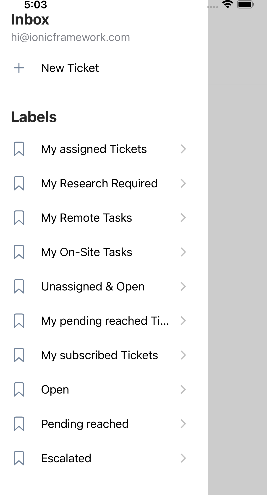

# Basic Zammad Mobile App

This is a very (very) basic mobile app for Zammad.  It's based on Ionic Framework / React.

This is made out of annoyance of my inability to control things easily from my phone.  It's ugly code, feel free to make it pretty

You also need to add the following headers to allow CORS (the below example is for Apache):


```
  <IfModule mod_headers.c>
    Header set Access-Control-Allow-Origin "capacitor://localhost" #Replace with the following for debug, but dont leave it that way!
    # Header set Access-Control-Allow-Origin "*"
    Header set Access-Control-Allow-Methods "GET,PUT,POST,DELETE,PATCH,OPTIONS"
    Header set Access-Control-Allow-Headers "Origin, X-Requested-With, Content-Type, Accept, Authorization"
  </IfModule>
```

Status (and order of priorities):

- [X] List and view ticket overviews
- [X] List and view overview tickets
- [X] View Ticket Replies
- [X] Reply to Tickets
    - [X] Account Time
    - [ ] Set Ticket State
- [ ] Create new ticket
- [ ] App Notifications
- [ ] Update Ticket Meta
- [ ] Control which fields are displayed per view (based on Zammad config)
- [X] Generic login
- [ ] Publish app

If I have to write the whole thing myself I will put it for sale on app store (always open source, just precompiled "easy" version on app store is paid). 

